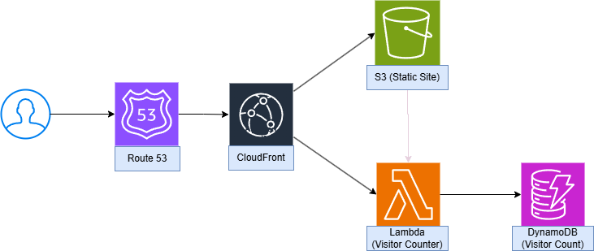

# 🌐 Jake Reck - Cloud DevOps Portfolio  

This is my personal portfolio website, showcasing my projects, experience, and skills in software engineering and cloud DevOps. The website is built with **HTML, CSS, and JavaScript** and deployed using **AWS services** for a scalable and serverless architecture.  



## 🚀 Features  
- **Static Hosting:** Deployed via an **S3 bucket** with **CloudFront** for global content delivery.  
- **Serverless Visitor Counter:** A Lambda function updates and displays the number of visitors.  
- **Custom Domain:** Managed with **Route 53**.  
- **CI/CD Pipeline:** GitHub repository is connected to **AWS CodePipeline**, ensuring automatic deployment on updates.  
- **Responsive Design:** Optimized for desktop and mobile viewing.  

## 🛠 Technologies Used  
### **Frontend:**  
- **HTML5, CSS3, JavaScript**  
- **Google Fonts (Geist Mono)**  

### **Cloud & DevOps:**  
- **AWS S3** (Static site hosting)  
- **AWS CloudFront** (CDN for fast delivery)  
- **AWS Route 53** (Domain management)  
- **AWS Lambda** (Serverless visitor counter)  
- **API Gateway** (Communication with the database)
- **DynamoDB** (Database for visitor count)
- **AWS CodePipeline** (CI/CD integration)  

## 📂 Project Structure  

```plaintext
📦 aws-portfolio  
 ┣ 📜 index.html            # Main HTML structure  
 ┣ 📜 styles.css            # Styling for the website  
 ┣ 📜 script.js             # JavaScript for interactions  
 ┣ 📜 README.md             # Project documentation  
 ┣ 📜 assets/               # Folder for images & static assets  
 ┗ 📜 .gitignore            # Ignore unnecessary files  
